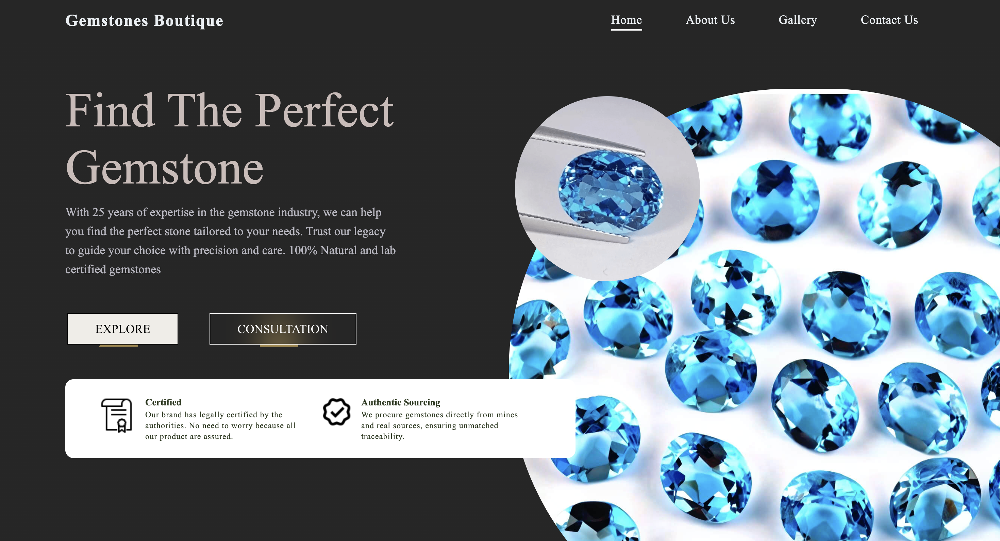
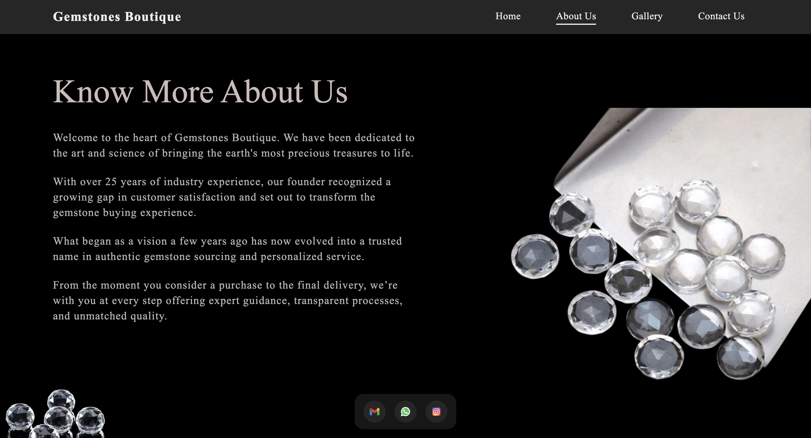

# 💎 Gemstones Boutique

A visually rich and responsive gemstone showcase website that allows users to explore a curated collection of semi-precious, lab-grown, and precious gemstones. Built for a gemstone business to connect potential buyers with dealers through a clean and modern user interface.

🔗 **Live Demo:** [https://freelance-project-demo.vercel.app]()  
> ⚠️ _This is a personal demo version of a freelance project, built and deployed for showcase purposes only. The original production site is hosted privately._

---

## ✨ Features

- 🪷 **Category-wise Display**: Explore gemstones under Semi-Precious, Lab-Grown, and Precious categories.
- 📱 **Responsive Design**: Optimized for desktop, tablet, and mobile viewports.
- 📸 **High-Quality Visuals**: Each product is displayed with detailed images and descriptions.
- 📞 **Dealer Contact Section**: Users can connect directly with gemstone dealers for offline purchasing.

---

## 🔧 Tech Stack

- **Frontend**: React.js, Tailwind CSS
- **Email Handling**: [EmailJS](https://www.emailjs.com/)
- **Search**: Google Programmable Search Engine
- **Analytics**: Google Analytics 4 (GA4)
- **Hosted**: Vercel , Hostinger

---

## 📸 Screenshots

<!-- Add screenshots to your repo and link them here -->

---
